# dnt303
## (
## Lệnh cài đặt lần lượt là

git clone https://github.com/nhan0303/doctruyen303.git

rồi sau đó mở vscode thư mục chứa code

mở terminal và chạy lệnh flutter pub get

sau khi đã chạy xong thì mở main_dev.dart

=> run
## )
ứng dụng đọc truyện di động

A cross-platform manga reader built with Flutter.

This app is a Flutter clone of Tachiyomi mainly to provide an iOS version of the app.

This project is still a work in progress.

## Screenshots

| Views | Light | Dark | Pure Dark |
| --- | --- | --- | --- |
| Library | 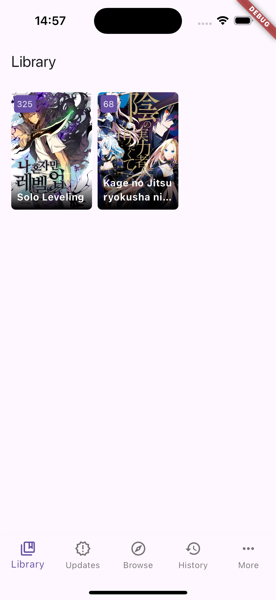 | 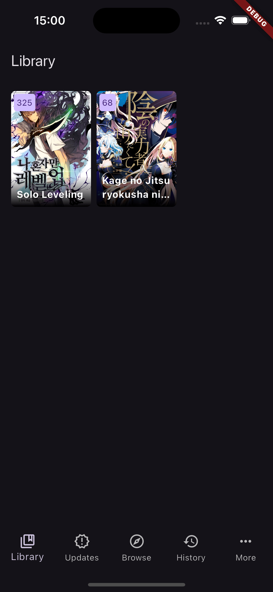 | 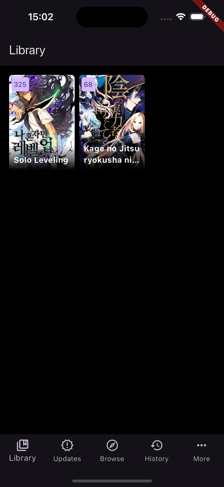 |
| Explorer | 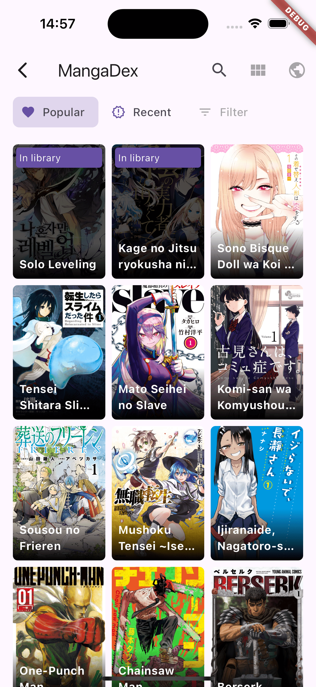 | 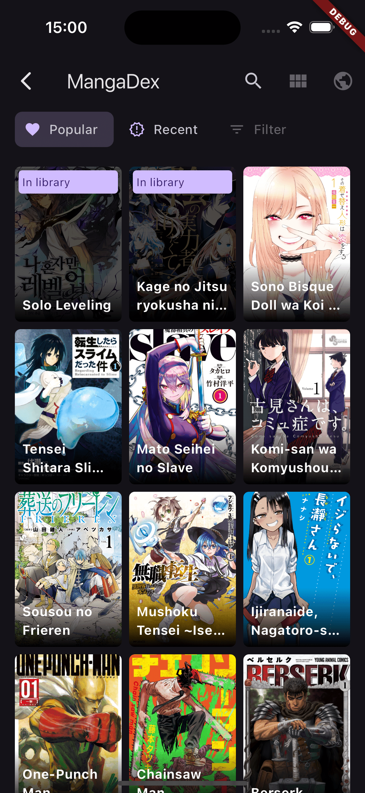 | 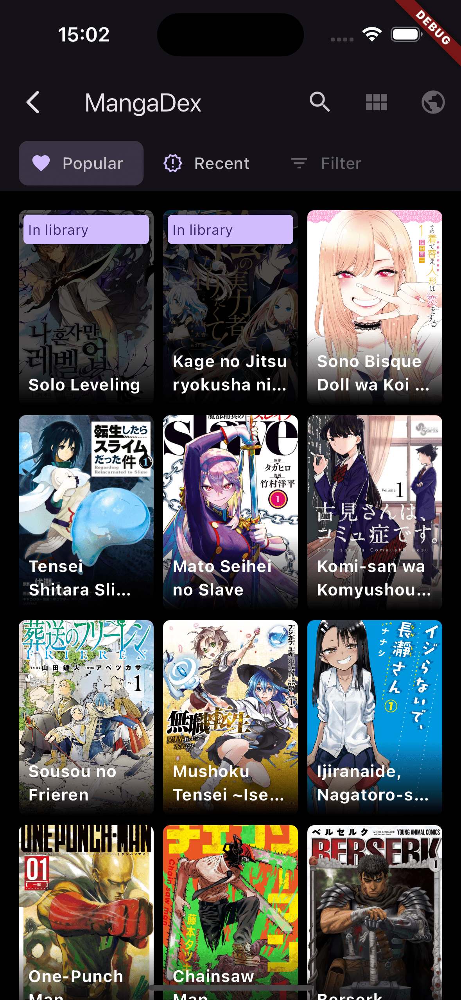 |
| Details | 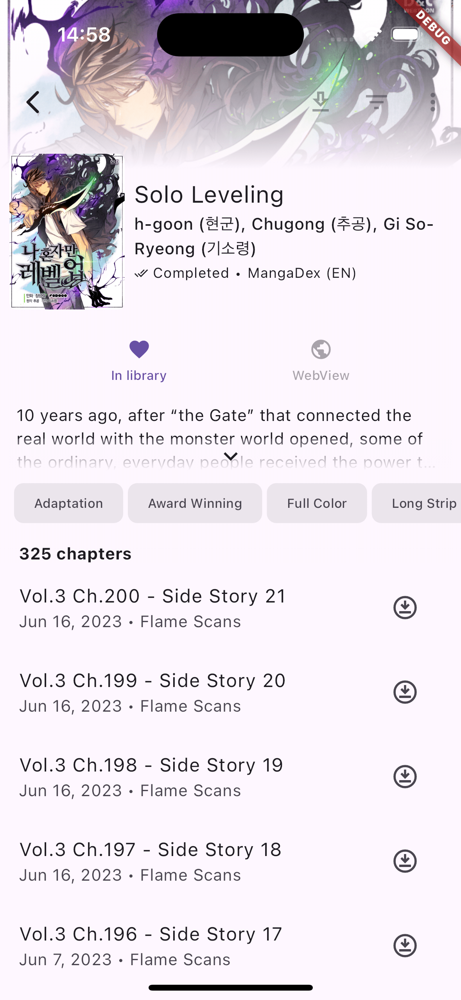  | 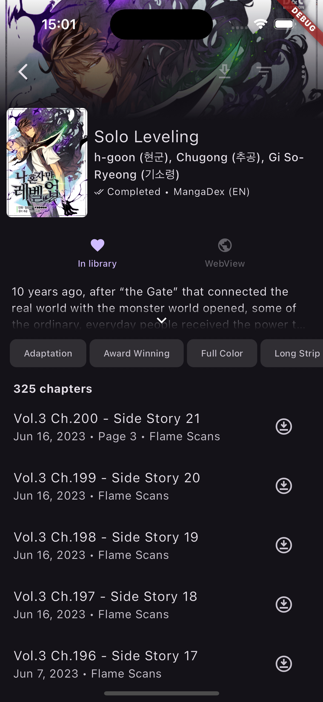  | 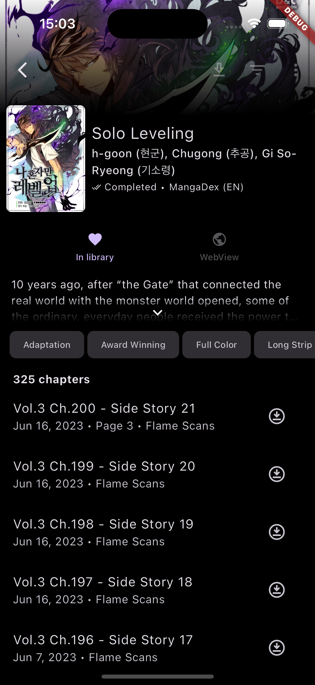 |
| Reader | 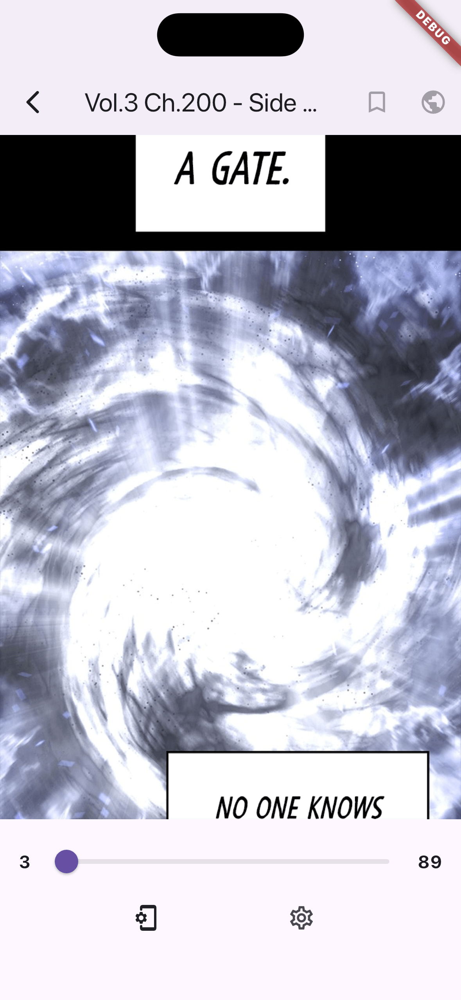 | 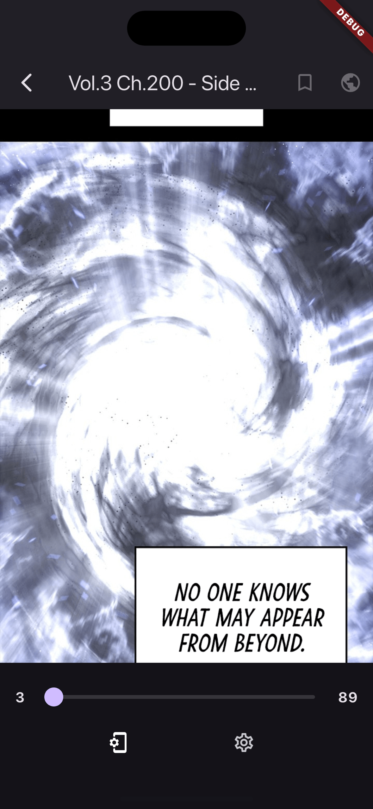 |  |
| History | 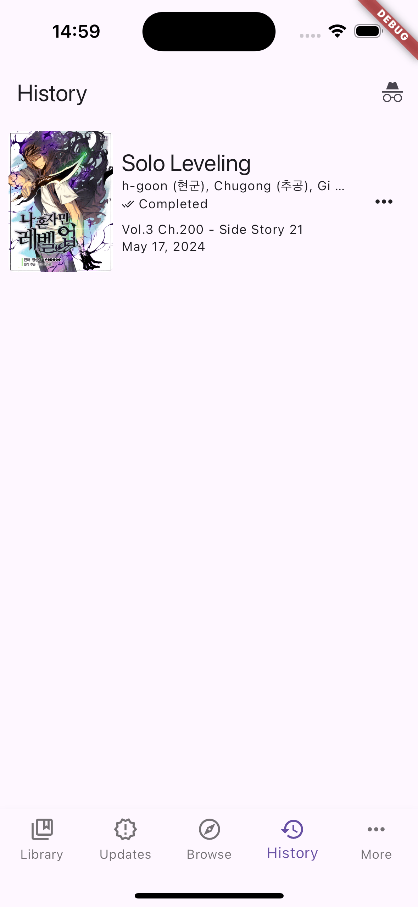 | 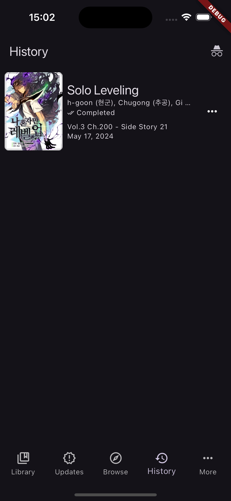 | 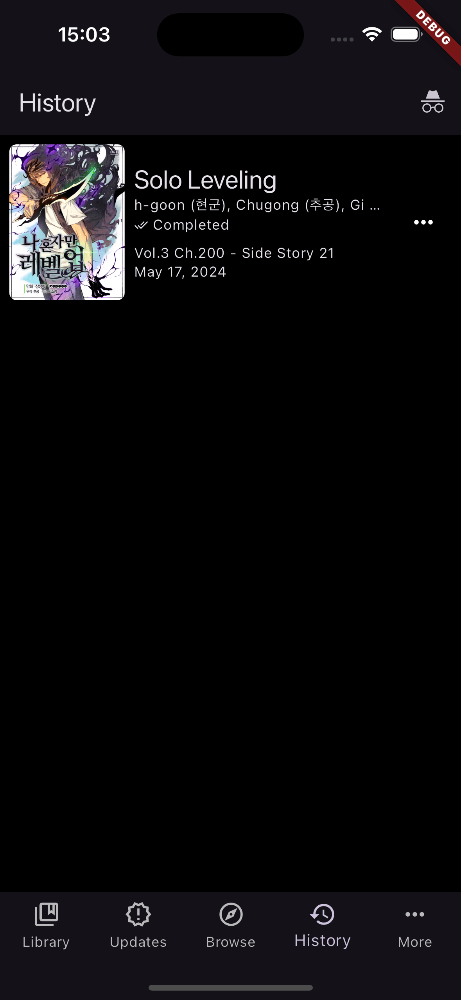 |

##Support source

| Source | Supported |
| --- | --- |
| Asura Scans | :red_circle: |
| DragonTea | :red_circle: |
| EarlyManga | :red_circle: |
| MangaBat | :white_check_mark: |
| MangaDex | :white_check_mark: |
| Mangahere | :red_circle: |
| Mangairo | :white_check_mark: |
| Mangakakalot | :white_check_mark: |
| Manganato | :white_check_mark: |
| Webtoons.com | :red_circle: |

## Features

* Import manga & chapters from a Tachiyomi/Mihon backup
* Global update of chapters
* Webtoon and paginated manga reading
* Download manga chapters for offline reading
* Reading history
* Language support for English and French
* Light and dark themes
* Pure Dark theme

##Technology Stack

Frontend Libraries (Flutter)

Flutter SDK

Flutter Riverpod (State Management)

GoRouter & GoRouter Builder (Routing)

Drift (ORM for SQLite)

Freezed & JSON Serializable (Data Modeling)

Cached Network Image (Image Caching)

Background Downloader (Download Management)

Flutter SVG (Vector Graphics)

Theme Tailor (Theming)

Scrollable Positioned List (UI Scrolling)

##Local Database & System Libraries

SQLite (Core Database engine)

sqlite3_flutter_libs (Native SQLite implementation)

Path Provider (Local File System access)

Permission Handler (Permission management)

Logging (System Logs)
